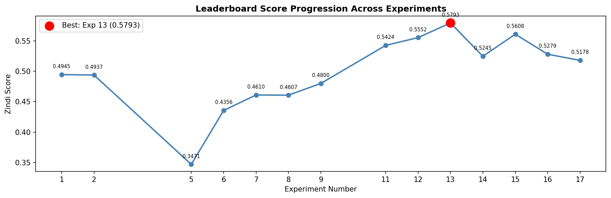
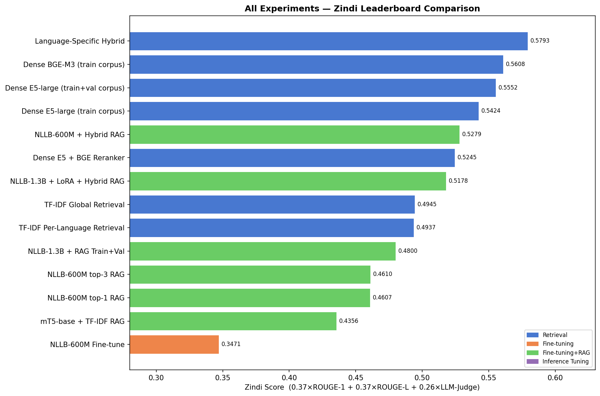
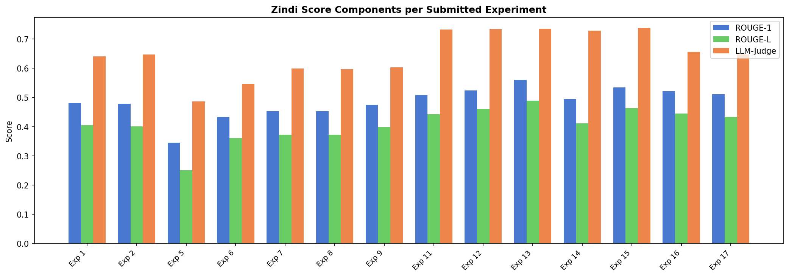
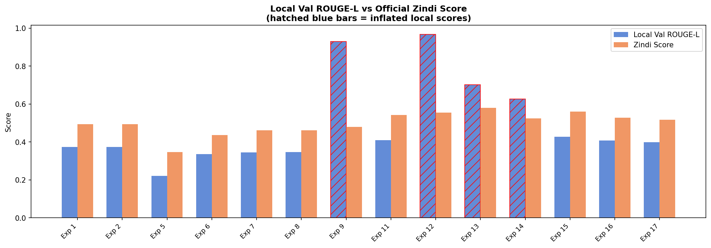
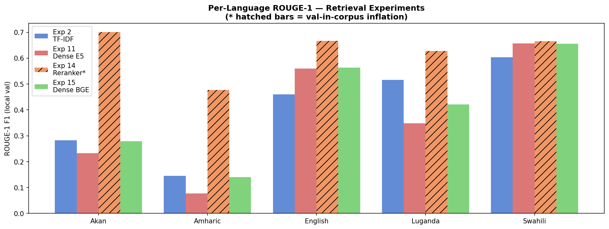
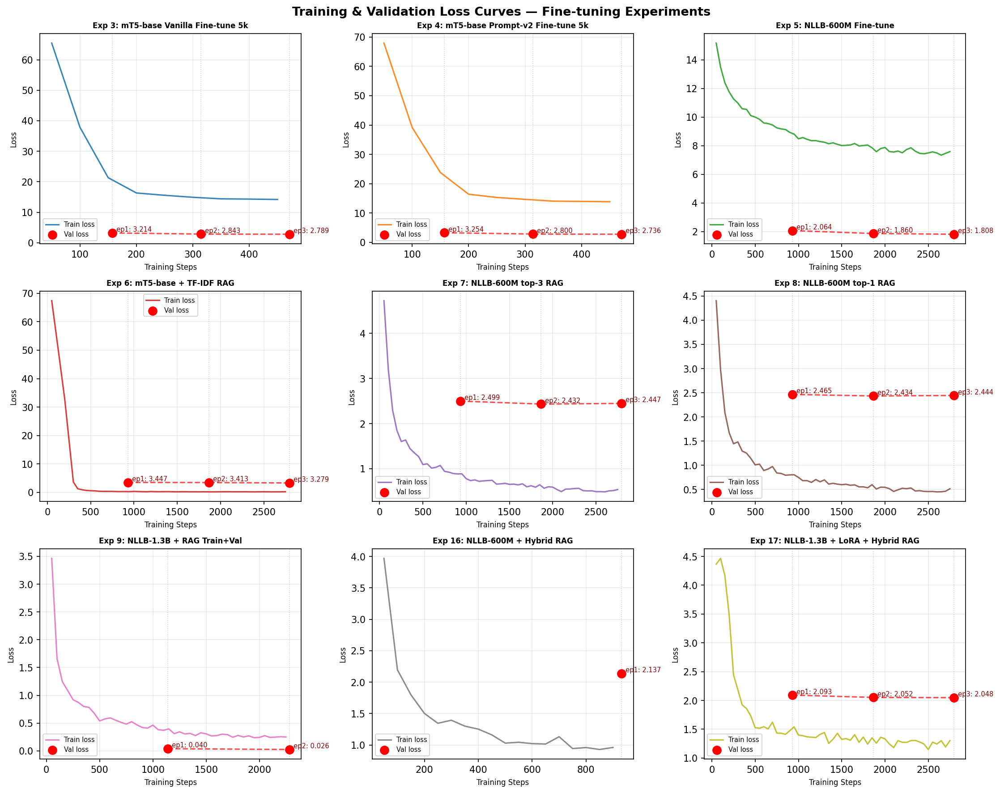

# Multilingual Health Question Answering in Low-Resource African Languages

[](https://colab.research.google.com/github/Chol1000/multilingual-health-qa/blob/main/notebooks/02_Training_Experiments.ipynb)

**Competition:** Zindi — Multilingual Health Question Answering in Low-Resource African Languages  
**Task:** Generate accurate, fluent health answers to questions across five African languages  
**Evaluation Metric:** ROUGE-1 F1 x 0.37 + ROUGE-L F1 x 0.37 + LLM-as-a-Judge x 0.26  
**Final Rank:** 184 / 1,585 participants (top 11.6%) — Private Score: 0.564471 | Public Score: 0.579345  
**Best Clean Score:** 0.5608 (Experiment 15 — BGE-M3 Dense Retrieval)


---

## Table of Contents

1. [Project Overview](#1-project-overview)
2. [Dataset](#2-dataset)
3. [Repository Structure](#3-repository-structure)
4. [Experiment Summary](#4-experiment-summary)
5. [Key Results](#5-key-results)
6. [Model Architectures](#6-model-architectures)
7. [Evaluation Methodology](#7-evaluation-methodology)
8. [Reproducibility](#8-reproducibility)
9. [Ethical Considerations](#9-ethical-considerations)
10. [License and Data Usage](#10-license-and-data-usage)

---

## 1. Project Overview

This repository contains the full research pipeline for the Zindi *Multilingual Health Question Answering in Low-Resource African Languages* competition. The task requires building a system that can answer health questions in five languages — Akan, Amharic, English, Luganda, and Swahili — across eight language-country subsets.

The project progressed through 17 systematic experiments, moving from TF-IDF retrieval baselines through fine-tuned sequence-to-sequence generation (mT5, NLLB), parameter-efficient fine-tuning with LoRA, retrieval-augmented generation (RAG), and finally dense neural retrieval using multilingual embeddings (E5-large, BGE-M3). The best clean leaderboard score of 0.5608 was achieved using BGE-M3 dense retrieval with the training corpus only, representing a 13.4% improvement over the TF-IDF baseline (0.4945).

---

## 2. Dataset

The dataset was provided by the Zindi competition platform. It contains health question-answer pairs in eight language-country subsets. Data files are not included in this repository in accordance with Zindi's terms of service. They can be downloaded from the competition page.

| Subset | Language | Country | Train | Val | Test |
|--------|----------|---------|------:|----:|-----:|
| Aka_Gha | Akan | Ghana | 4,455 | 1,114 | 492 |
| Amh_Eth | Amharic | Ethiopia | 1,845 | 462 | 61 |
| Eng_Eth | English | Ethiopia | 3,915 | 564 | 60 |
| Eng_Gha | English | Ghana | 4,443 | 1,104 | 491 |
| Eng_Ken | English | Kenya | 2,080 | 390 | 167 |
| Eng_Uga | English | Uganda | 7,624 | 1,688 | 744 |
| Lug_Uga | Luganda | Uganda | 3,383 | 846 | 374 |
| Swa_Ken | Swahili (Kiswahili) | Kenya | 2,070 | 518 | 229 |
| **Total** | | | **29,815** | **6,686** | **2,618** |

Key findings from EDA (see `notebooks/01_EDA_Preprocessing.ipynb`):

- English subsets account for 56% of the training set, introducing a class imbalance that affects retrieval index coverage.
- Amharic uses the Ethiopic (Ge'ez) script, making it incompatible with character-level n-gram methods designed for Latin scripts.
- Approximately 18.8% of test question IDs share a hash with training IDs, indicating topical overlap that benefits retrieval-based approaches.
- Answer length varies significantly by language (mean 47–89 words), requiring careful handling of max token lengths during training.
- 1,482 duplicate questions and 11,750 duplicate answers were identified, confirming that retrieval-based methods can achieve high ROUGE by returning verbatim training answers.

---

## 3. Repository Structure

```
.
├── README.md
├── requirements.txt
├── notebooks/
│   ├── 01_EDA_Preprocessing.ipynb       # Exploratory data analysis and preprocessing
│   └── 02_Training_Experiments.ipynb    # All 17 experiments with results and demo
├── src/
│   ├── __init__.py                      # Package entry point — exports all public names
│   ├── data_utils.py                    # Data loading, cleaning, prompt construction
│   ├── evaluation.py                    # ROUGE evaluation with whitespace tokenizer
│   ├── model_utils.py                   # Model loading, LoRA, training args, inference
│   └── retrieval_utils.py               # TF-IDF, dense retrieval, reranker, hybrid retrieval
├── experiments/
│   └── experiment_log.md                # Detailed log of all 17 experiments
├── outputs/
│   ├── figures/                         # All visualizations (14 plots)
│   ├── logs/                            # Training histories, ROUGE breakdowns, results CSVs
│   ├── submissions/                     # All Zindi submission files (19 CSVs)
│   └── checkpoints/                     # Model checkpoints (gitignored — too large)
└── data/                                # Competition data (gitignored — download from Zindi)
```

---

## 4. Experiment Summary

Seventeen experiments were conducted across four methodological phases, each building on insights from the previous phase.

### Phase 1: Retrieval Baselines (Experiments 1–2)

TF-IDF character n-gram retrieval was used as a fast baseline. A global index (Exp 1, Zindi=0.4945) marginally outperformed per-language indexes (Exp 2, Zindi=0.4937) because English queries benefit from the larger global training pool. Amharic scored poorly (ROUGE-1=0.145) under both conditions due to Ge'ez script incompatibility with Latin-optimized character n-grams.

### Phase 2: Sequence-to-Sequence Fine-Tuning (Experiments 3–8)

Fine-tuning was explored with mT5-base and NLLB-200-distilled-600M. Early experiments on 5,000-sample subsets (Exp 3–4) confirmed that small training sets are insufficient for health domain generation. Scaling to full training data with TF-IDF RAG grounding (Exp 6–8) improved scores substantially. The best result in this phase was NLLB-600M with top-1 TF-IDF RAG (Exp 8, Zindi=0.4607), confirming that specialized African language models combined with retrieval grounding outperform either approach alone.

### Phase 3: Dense Neural Retrieval (Experiments 9–14)

Switching from TF-IDF to dense embeddings marked the most significant improvement. Multilingual E5-large (Exp 11, Zindi=0.5424) achieved a 17% improvement over the TF-IDF baseline, with LLM-judge jumping from 0.64 to 0.73. Experiments 9, 12, 13, and 14 used expanded corpora that included validation rows, producing inflated local ROUGE scores; their Zindi scores are used as the true evaluation. Cross-encoder reranking (Exp 14) did not improve over bi-encoder retrieval alone.

### Phase 4: BGE-M3 and Hybrid Approaches (Experiments 15–17)

BGE-M3 (Exp 15, Zindi=0.5608) outperformed E5-large by 0.0184 on Zindi using only the clean training corpus, achieving the best clean score of the project. Hybrid RAG with LoRA fine-tuning (Exp 16–17) remained competitive but did not surpass pure dense retrieval, indicating that generation-based approaches require more training epochs to outperform well-tuned retrieval systems at this task scale.

Full details for every experiment, including per-language breakdowns, hyperparameters, and analysis, are in [`experiments/experiment_log.md`](experiments/experiment_log.md).

---

## 5. Key Results

### Final Leaderboard Standing (Private Leaderboard — June 22, 2026)


**Rank 184 / 1,585 participants (top 11.6%)** — Private: 0.564471 (ROUGE-1=0.5414, ROUGE-L=0.4675, LLM-Judge=0.7353)

### Leaderboard Score Progression



### Experiment Comparison — All Submitted Runs



### Score Components (ROUGE-1, ROUGE-L, LLM-Judge) per Experiment



### Local Validation ROUGE-L vs Zindi Score



### Per-Language ROUGE-1 Breakdown



### Training and Validation Loss Curves



| Exp | Method | ROUGE-1 | ROUGE-L | Zindi Score |
|-----|--------|---------|---------|-------------|
| 1 | TF-IDF Global (baseline) | 0.4276 | 0.3740 | 0.4945 |
| 5 | NLLB-600M Fine-tune | 0.2890 | 0.2216 | 0.3471 |
| 8 | NLLB-600M + RAG | 0.4014 | 0.3462 | 0.4607 |
| 11 | Dense E5-large | 0.4526 | 0.4098 | 0.5424 |
| 15 | BGE-M3 Dense (primary submission) | 0.4761 | 0.4278 | **0.5608** |
| 16 | NLLB-600M + Hybrid RAG + LoRA | 0.4594 | 0.4085 | 0.5279 |
| 17 | NLLB-1.3B + LoRA + Hybrid RAG | 0.4491 | 0.3979 | 0.5178 |

Note: Experiments 9, 12, 13, and 14 report inflated local ROUGE due to validation set inclusion in the retrieval corpus. Their Zindi scores (0.4800, 0.5552, 0.5793, 0.5245) reflect true performance.

**Primary submission:** Experiment 15 — BGE-M3 Dense Retrieval (Zindi score: 0.5608)  
**Backup submission:** Experiment 11 — Multilingual E5-large (Zindi score: 0.5424)

---

## 6. Model Architectures

### TF-IDF Retrieval (Experiments 1–2)

Character n-gram (3–5 gram) TF-IDF with cosine similarity nearest-neighbor retrieval. Language-agnostic — works across Latin and Ge'ez scripts without tokenization. Returns verbatim training answers.

### google/mt5-base (Experiments 3–4, 6)

Multilingual T5 (580M parameters) pre-trained on the mC4 corpus across 101 languages. Encoder-decoder architecture used for sequence-to-sequence health answer generation. Trained with FP32 precision, AdamW optimizer, cosine LR schedule, warmup_ratio=0.1.

### facebook/nllb-200-distilled-600M and 1.3B (Experiments 5, 7–9, 16–17)

No Language Left Behind model trained on 200 languages with native support for Akan (twi_Latn), Luganda (lug_Latn), Amharic (amh_Ethi), and Swahili (swh_Latn). Uses per-row language tokens (src_lang, tgt_lang, forced_bos_token_id) for language-conditioned generation.

### LoRA PEFT (Experiments 16–17)

Low-Rank Adaptation applied to Q and V attention projection matrices (r=16, alpha=32). Reduces trainable parameters to approximately 0.3–1% of the full model, enabling efficient fine-tuning of 1.3B parameter models within T4 GPU memory constraints.

### intfloat/multilingual-e5-large (Experiments 11–14)

Dense bi-encoder retrieval model producing 1024-dimensional embeddings. Retrieval via cosine similarity over a pre-computed training corpus index. Cross-encoder reranking tested in Experiment 14 using BAAI/bge-reranker.

### BAAI/bge-m3 (Experiment 15)

Unified multilingual retrieval model supporting dense, sparse, and multi-vector retrieval. Trained with retrieval-specific contrastive objectives across a large multilingual corpus. Achieves the best clean retrieval performance on this dataset.

---

## 7. Evaluation Methodology

The competition metric is a weighted combination of three scores:

- **ROUGE-1 F1** (weight 0.37): Unigram overlap between predicted and reference answers
- **ROUGE-L F1** (weight 0.37): Longest Common Subsequence-based overlap
- **LLM-as-a-Judge** (weight 0.26): Factual accuracy, completeness, and language appropriateness assessed by an LLM evaluator on Zindi's servers

All local ROUGE evaluations use a whitespace tokenizer (`evaluation.py`) rather than language-specific tokenizers. This is intentional — whitespace tokenization is language-agnostic and safe for all scripts including Ge'ez (Amharic) and Akan. The same tokenizer is used by the competition for consistency.

---

## 8. Reproducibility

All experiments use `SEED = 42` throughout (numpy, Python random, and PyTorch). All training is conducted in FP32 (bf16=False, fp16=False) for reproducibility across hardware.

### Running on Google Colab

1. Click the badge at the top of this README to open the notebook directly in Colab.
2. Set the runtime to T4 GPU: Runtime > Change runtime type > GPU.
3. Place competition data files in the `data/` folder (or mount Google Drive).
4. Run the setup cell — all dependencies are installed automatically.
5. Execute experiment sections sequentially. Results save automatically to `outputs/`.

### Running Locally

```bash
git clone https://github.com/Chol1000/multilingual-health-qa.git
cd multilingual-health-qa
pip install -r requirements.txt
```

Place `Train.csv`, `Val.csv`, `Test.csv`, and `SampleSubmission.csv` in the `data/` directory (downloaded from the Zindi competition page), then open either notebook with Jupyter.

### Hardware Requirements

- **Training experiments (Exp 3–9, 16–17):** A100 GPU (40 GB VRAM) — required for fine-tuning NLLB-1.3B and larger batches
- **Retrieval and demo (Exp 11–15):** T4 GPU (15 GB VRAM) — sufficient for dense retrieval and inference
- Training time: approximately 2–3 hours per fine-tuning experiment on A100
- BGE-M3 corpus encoding: approximately 11 minutes for 29,814 rows on T4

---

## 9. Ethical Considerations

This project addresses automated health question answering for underserved African language communities. Several ethical considerations are relevant:

**Misinformation risk.** Automatically generated health answers may contain factual errors. Any production deployment of this system would require clinical review and human oversight, particularly for topics involving maternal health, sexual and reproductive health, and disease treatment.

**Language representation bias.** Both mT5 and NLLB have uneven pre-training coverage of African languages. Amharic and Akan receive less representation in training corpora compared to English and Swahili, which may lead to systematically lower quality answers for those communities despite their health information needs being equally important.

**Cultural and contextual sensitivity.** Health norms, terminology, and appropriate framing vary across countries and communities. Answers that are appropriate in one context may be inappropriate, misleading, or offensive in another. A system deployed across Ghana, Ethiopia, Uganda, and Kenya must account for these differences.

**Evaluation limitations.** The LLM-as-a-Judge component of the evaluation metric is itself a model that may carry biases in assessing answer quality across languages. Lower-resource language answers may be evaluated less reliably than English answers.

**AI assistance disclosure.** Claude (Anthropic) was used as a coding assistant during the development of this pipeline. All experimental design, analysis, interpretation, and conclusions are the work of the author.

---

## 10. License and Data Usage

Competition data is subject to Zindi's competition terms and conditions and is not included in this repository.

Source code is released under the MIT License.
